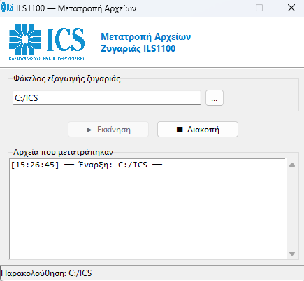

# Οδηγός Μετατροπής Αρχείων Ζυγαριάς ILS1100

> **Κατέβασμα προγράμματος →** [CP737_Converter.exe](https://github.com/arch1based/ICS/releases/latest/download/CP737_Converter.exe)

Αυτό το εργαλείο επιτρέπει τη **σύνδεση των ζυγαριών ILS1100 με προγράμματα ERP**, μετατρέποντας αυτόματα τα αρχεία εξαγωγής της ζυγαριάς σε μορφή συμβατή με όλα τα σύγχρονα συστήματα (ERP, Excel, κ.λπ.).

> Η ζυγαριά ILS1100 αποθηκεύει δεδομένα σε παλιές ελληνικές κωδικοποιήσεις (CP1253/CP737).
> Αυτό προκαλεί εμφάνιση "κινέζικων" χαρακτήρων όταν το αρχείο εισάγεται στο ERP ή ανοίγεται σε Excel.
> Το πρόγραμμα ανιχνεύει αυτόματα την κωδικοποίηση κάθε εγγραφής και τη διορθώνει, χωρίς καμία παρέμβαση του χρήστη.

---

## Εγκατάσταση

1. Κατεβάστε το **[CP737_Converter.exe](https://github.com/arch1based/ICS/releases/latest/download/CP737_Converter.exe)**
2. Αποθηκεύστε το σε έναν μόνιμο φάκελο (π.χ. `C:\ICS\`)
3. Δεν χρειάζεται εγκατάσταση — τρέχει απευθείας

---

## Χρήση

### Βήμα 1 — Ανοίξτε το πρόγραμμα

Διπλό κλικ στο **`CP737_Converter.exe`**

Θα εμφανιστεί το παρακάτω παράθυρο:

### Βήμα 2 — Ορίστε τον σωστό φάκελο

Πατήστε **`...`** και επιλέξτε τον φάκελο όπου η ζυγαριά ILS1100 αποθηκεύει τα αρχεία εξαγωγής.

> Συνήθως ο φάκελος είναι αυτός που έχετε ρυθμίσει στο λογισμικό της ζυγαριάς ως "φάκελος εξαγωγής" ή "export path".

### Βήμα 3 — Πατήστε Εκκίνηση

Πατήστε **`▶ Εκκίνηση`**. Από εδώ και πέρα, κάθε φορά που η ζυγαριά εξάγει αρχείο, το πρόγραμμα το μετατρέπει αυτόματα σε λίγα δευτερόλεπτα.

**Την επόμενη φορά που ανοίγετε το πρόγραμμα, ξεκινά αυτόματα** — δεν χρειάζεται να κάνετε τίποτα.

---

## Αυτόματη εκκίνηση με τα Windows

Για να ξεκινά το πρόγραμμα αυτόματα όταν ανοίγει ο υπολογιστής:

1. Πατήστε `Win + R`, πληκτρολογήστε `shell:startup` και πατήστε Enter
2. Αντιγράψτε το `CP737_Converter.exe` (ή φτιάξτε shortcut) στον φάκελο που άνοιξε

---

## Συχνές ερωτήσεις

**Το αρχείο εξακολουθεί να εμφανίζει κινέζικα μετά τη μετατροπή;**
Βεβαιωθείτε ότι το πρόγραμμα δείχνει "OK" στο log για το συγκεκριμένο αρχείο. Αν ανοίγετε με Excel, επιλέξτε κωδικοποίηση **UTF-8** κατά την εισαγωγή.

**Πού αποθηκεύονται τα αρχικά αρχεία;**
Κάθε αρχείο πριν τη μετατροπή αποθηκεύεται στον υποφάκελο `backup_greek\` μέσα στον φάκελο παρακολούθησης.

**Το πρόγραμμα μετατρέπει το ίδιο αρχείο δύο φορές;**
Όχι — το πρόγραμμα θυμάται ποια αρχεία έχουν ήδη μετατραπεί.

---

## Ιστορικό εκδόσεων

| Έκδοση | Αλλαγές |
|--------|---------|
| **v2** | Αυτόματη ανίχνευση κωδικοσελίδας CP1253/CP737 ανά εγγραφή — διορθώνει τα «κινέζικα» σε αρχεία με μεικτή κωδικοποίηση |
| v1 | Αρχική έκδοση |

---

## Τεχνική Υποστήριξη

Για βοήθεια επικοινωνήστε με το **Τεχνικό Τμήμα ICS — Καραφύλλης Συστήματα Πληροφορικής**.
